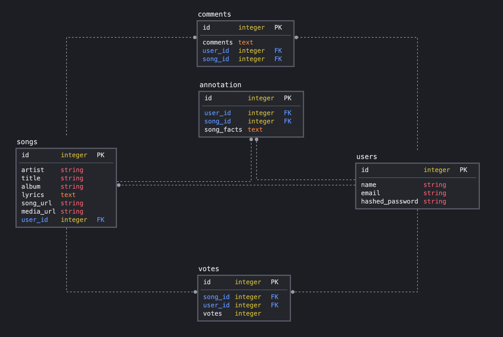

# 천재 Cheonjae - A [Genius](https://genius.com/) Clone for K-Pop.
*by [Ashley Gant](https://github.com/dev-kagant/) [Safiya Cain](https://github.com/scain3) [Kimi Zou](https://github.com/Kimi-Zou) [Damien Darko](https://github.com/djangothesolarboy)*

Table Of Contents:
---
- [Description](https://github.com/dev-kagant/python-genius-group2#Description)
- [Application Architecture && Technologies Used](https://github.com/dev-kagant/python-genius-group2#Application-Architecture-&&-Technologies-Used)
- [Frontend Overview](https://github.com/dev-kagant/python-genius-group2#Frontend-Overview)
- [Backend Overview](https://github.com/dev-kagant/python-genius-group2#Backend-Overview)

Description:
---
천재 Cheonjae (Genius) is a [Genius.com](https://genius.com/) clone but specifically for K-Pop songs!  

Application Architecture && Technologies Used:
---

Frontend Overview:
---

Backend Overview:
---

Relational Database Model:
---

The database schema:
