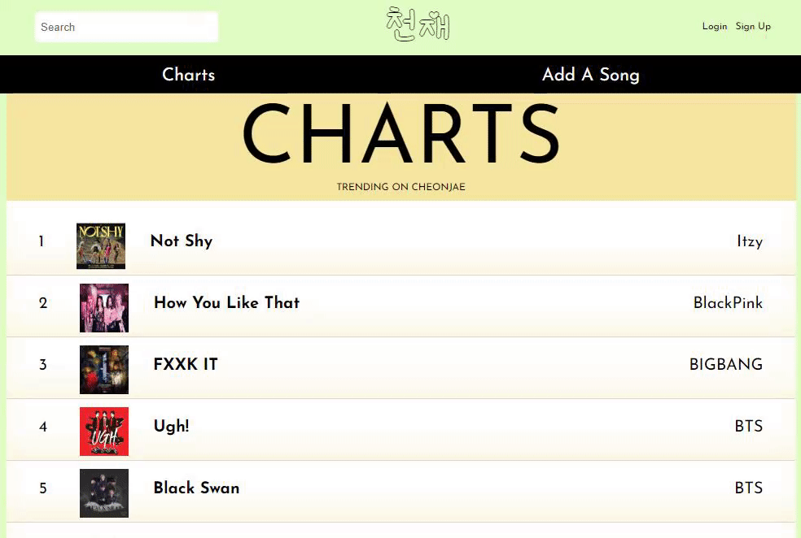
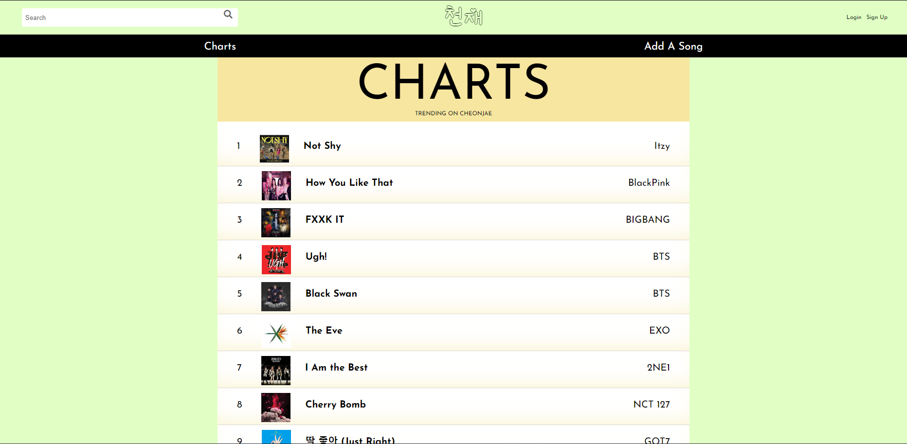
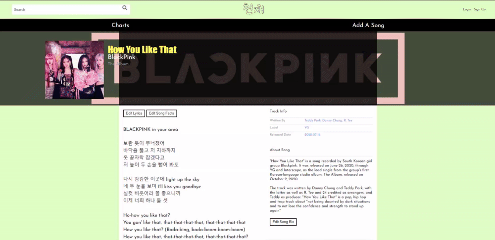
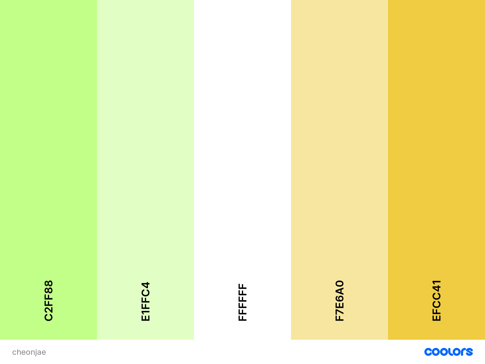
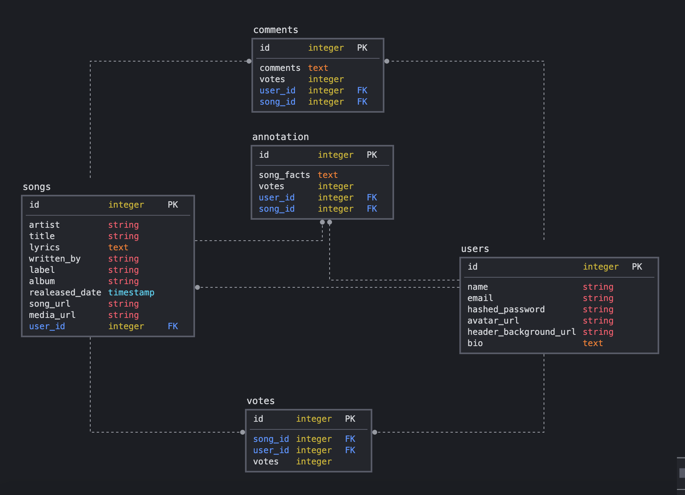

# [천재 Cheonjae](https://cheonjae.herokuapp.com/) - A [Genius](https://genius.com/) Clone for K-Pop.
*by [Ashley Gant](https://github.com/dev-kagant/), [Safiya Cain](https://github.com/scain3), [Kimi Zou](https://github.com/Kimi-Zou), [Damien Darko](https://github.com/djangothesolarboy)*

Table Of Contents:
---
- [Description](https://github.com/dev-kagant/python-genius-group2#Description)
- [Application Architecture && Technologies Used](https://github.com/dev-kagant/python-genius-group2#Application-Architecture-&&-Technologies-Used)
- [Frontend Overview](https://github.com/dev-kagant/python-genius-group2#Frontend-Overview)
- [Backend Overview](https://github.com/dev-kagant/python-genius-group2#Backend-Overview)

Description:
---
천재 Cheonjae (Genius) is a [Genius.com](https://genius.com/) clone but specifically for K-Pop songs!  

Application Architecture && Technologies Used:
---
Cheonjae was built using Flask with a PostgreSQL(postgres) database to store all the data for the application.

The front end uses React, Redux, Javascript, HTML and CSS for the styling.

Frontend Overview:
---
This application relies a good amount of the backend's database. It uses the database to store the information provided by a user to display it on the frontend for the user. The frontend is made up of some vanilla Javascript & CSS along with React & React.

Example of Login Validation:
```
export const login = async (email, password) => {
  const response = await fetch('/api/auth/login', {
    method: 'POST',
    headers: {
      'Content-Type': 'application/json'
    },
    body: JSON.stringify({
      email,
      password
    })
  });
  return await response.json();
}
```


Charts:


Song Page:


Color Palette used:  

Inchworm(darker): `#C2FF88`  
Tea Green(lighter): `#E1FFC4`  
White: `#FFFFFF`  
Medium Champagne(lighter): `#F7E6A0`  
Jonquil(darker): `#EFCC41`  

Backend Overview:
---
The backend is made using Flask, Python, WTForms, Flask_wtf and PostgreSQL for the database.

Relational Database Model:
---
The database for Cheonjae consists of five tables that rely a good amount on one another.

The database schema:
